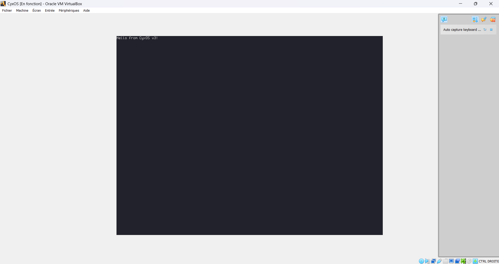

# ZCyxOS

3rd attempt at making ~~an OS~~ a kernel, this time in Zig with the limine bootloader.

## Current progress



## How to build

Make sure you use **Zig 0.15.2**.

First, install dependencies:

```bash
git clone https://codeberg.org/Limine/Limine.git limine --branch=v10.x-binary --depth=1
```

> It's not really a dependency, but you'll need it if you want to make a bootable image out of the kernel

Then build the sources:

```bash
zig build
```

The resulting kernel will be in `zig-out/bin-[arch]/zcyxos.[arch].elf`.

### Making a bootable ISO

Example shown for x86-64, but it should work fine with 64-bit other architectures as well.

```bash
mkdir -p .zig-cache/iso_root/EFI/BOOT

cp limine.conf zig-out/bin-x86_64/zcyxos.x86_64.elf limine/{limine-bios.sys,limine-bios-cd.bin,limine-uefi-cd.bin} .zig-cache/iso_root
cp limine/{BOOTX64.EFI,BOOTIA32.EFI} .zig-cache/iso_root/EFI/BOOT

xorriso -as mkisofs -b limine-bios-cd.bin -no-emul-boot -boot-load-size 4 -boot-info-table --efi-boot limine-uefi-cd.bin -efi-boot-part --efi-boot-image --protective-msdos-label .zig-cache/iso_root -o zcyxos.iso
```